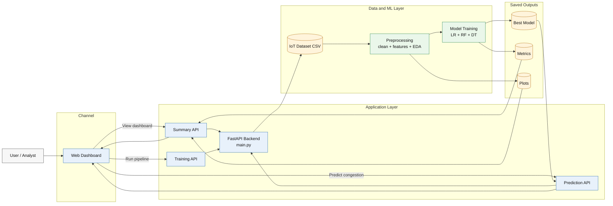

# Wireless Network Congestion Predictor Architecture

## Neat flow

- User interacts with the web dashboard.
- Dashboard calls the FastAPI APIs for summary, training, and prediction.
- Backend reads the IoT dataset and runs preprocessing plus model training.
- Best model, metrics, and plots are saved as outputs.
- Summary and prediction results are sent back to the dashboard.
